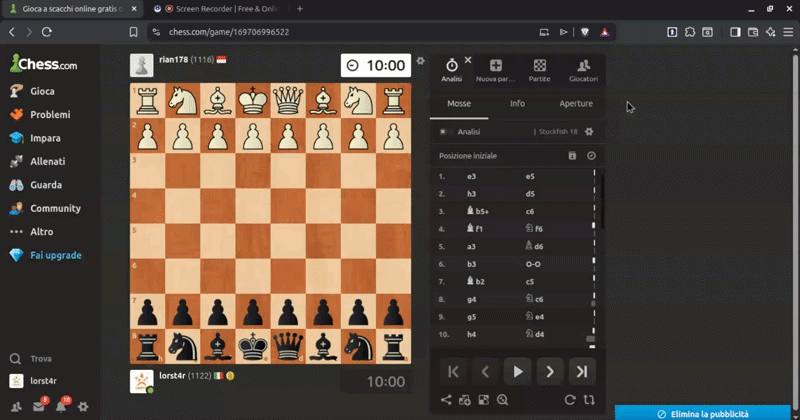

# ♟️ Chess to Lichess

Brave and Chrome browser extension that instantly transfers your finished games from **Chess.com** to **Lichess**, launching automatic computer analysis with a single click.

[](https://chromewebstore.google.com/detail/chess-to-lichess/fbnokpfclmbeinaadegoifhmhejmkfoh)



## Why use this extension?

Unlimited Stockfish computer analysis on Chess.com is restricted to paid premium tiers (up to $100/year). On Lichess, cloud server analysis is completely free, powerful, and unlimited. 
This extension automates the annoying manual process of exporting and importing PGN files in **less than 3 seconds**.

## Features

1. Finish a game on Chess.com.
2. Click the **extension icon** or press `Alt+Shift+L`.
3. The extension extracts the PGN, opens Lichess, fills out the paste form, checks *"Request computer analysis"*, and submits it automatically.

### One-Click Mode
Enable **One-click mode** in the popup settings to trigger the transfer by simply clicking the extension icon — no menu needed.

### Usage Stats
The popup tracks how many games you've analyzed and estimates how much money you've saved compared to a Chess.com Premium subscription. 💰

---

## Support the Project ☕

If this extension saves you time and money compared to a Chess.com Premium subscription, consider buying me a coffee on Ko-fi!

<a href="https://ko-fi.com/lorenzovasile" target="_blank">
  
</a>

---

## Installation

### Chrome Web Store (Recommended)
Install directly from the [Chrome Web Store](https://chromewebstore.google.com/detail/chess-to-lichess/fbnokpfclmbeinaadegoifhmhejmkfoh).

### Developer Mode
If you want to load it manually:

1. Clone or download this repository.
2. Open Chrome/Brave and navigate to `chrome://extensions/` (or `brave://extensions/`).
3. Enable **Developer mode** in the top right corner.
4. Click **"Load unpacked"** and select the extension folder.

### Customizable Shortcut
You can change the default keyboard shortcut (`Alt+Shift+L`) by visiting `chrome://extensions/shortcuts`.

## Project Structure

```
├── manifest.json       Manifest V3 config
├── background.js       Service worker (PGN extraction + Lichess automation)
├── popup.html/css/js   Extension popup UI (stats, settings, transfer)
├── _locales/           Multi-language support (EN, IT, DE, ES, FR, PT, RU)
├── demo.gif            Working demonstration animation
└── icons/              Extension icon assets
```

## Privacy

This extension does not collect, store, or transmit any personal data. Game PGNs are read locally in your browser and submitted directly to Lichess. No external servers are involved. Usage stats are stored locally on your device only.

## License

MIT
